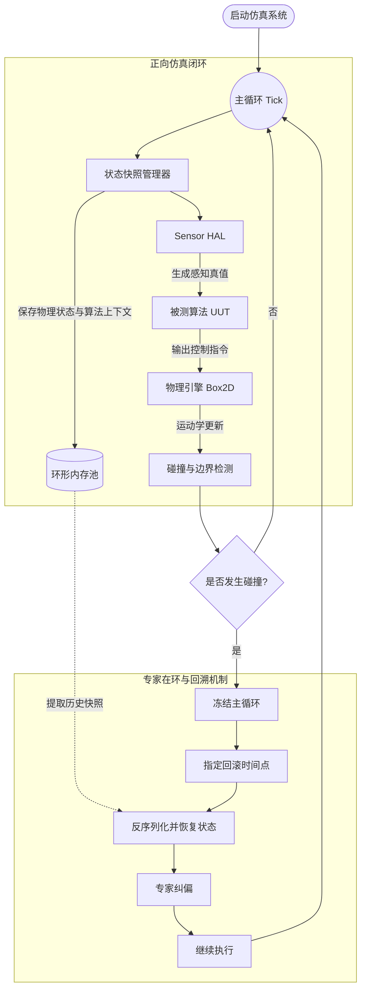

# ParkSim-2D

**极简、高确定性的 2D 泊车算法测试框架**

ParkSim-2D 是一个面向自动驾驶 **规划与控制（P&C）** 算法的轻量级闭环测试环境。  
它刻意避开 Gazebo / Carla 这类重型 3D 仿真的渲染负担，专注于：

- 高确定性物理闭环
- 微秒级状态快照
- 专家在环纠偏
- 历史状态回溯

目标是为泊车、路径跟踪、局部规划与控制算法提供一个**快速、稳定、可复现**的工程化验证平台。

> **假设前端感知已生成 BEV 图作为规划器输入，本框架只做算法验证，不做视觉包装。**

---

## 为什么选择 ParkSim-2D

传统 3D 仿真器适合展示效果，但在算法开发中常见以下问题：

- 资源消耗高
- 时序不稳定
- 调试链路长
- 难以稳定复现实验结果

ParkSim-2D 的设计原则很直接：

> **只做算法验证，不做视觉包装。**  
> **只保留闭环核心，不引入多余复杂度。**

---

## 核心特性

### 状态级时间回溯
基于环形缓冲区（Ring Buffer）保存历史快照。  
当算法发生碰撞或进入异常状态时，可快速回滚到指定时间点。

### 零动态分配主循环
Tick 主循环内避免动态内存分配，优先使用连续存储结构，提升实时性与缓存命中率。

### 统一传感器抽象
通过 Sensor HAL 层解耦算法与物理引擎，支持注入：

- 2D 激光雷达数据
- 带噪声的状态观测
- 目标列表信息
- 伪 IMU 数据

### 高确定性
采用固定时间步长，减少异步因素带来的结果漂移，保证实验可复现。

---

## 架构概览



---

## 目录结构

```text
test_loop/
├── CMakeLists.txt
├── include/test_loop/
│   ├── sim_types.hpp              (数据类型 + 场景配置)
│   ├── snapshot_manager.hpp       (环形缓冲区状态回溯器)
│   ├── sensor_hal.hpp             (传感器抽象 + 数据)
│   ├── i_parking_algorithm.hpp    (被测算法接入接口)
│   ├── simulator.hpp              (主仿真器)
│   ├── physics/
│   │   ├── world.hpp              (Box2D 世界封装)
│   │   └── vehicle.hpp            (车辆刚体 + 阿克曼转向)
│   └── sensor/
│       └── raycast_lidar.hpp      (ISensorHal 的 Ray-cast 实现)
├── src/
│   ├── simulator.cpp
│   ├── physics/
│   │   ├── world.cpp
│   │   └── vehicle.cpp
│   └── sensor/
│       └── raycast_lidar.cpp
├── tests/                         (doctest 单元测试)
├── examples/
│   ├── minimal_parking/           (Headless 碰撞 + 回滚)
│   ├── pid_tracking/              (Stanley/Pure Pursuit 轨迹跟踪)
│   └── visualization/             (Dear ImGui 实时可视化)
└── third_party/box2d/
```

---

## 环境依赖

- CMake >= 3.14
- GCC / Clang，支持 C++17
- Box2D（已作为 submodule 放在 `third_party/box2d/`）
- Linux: X11 开发库（用于 GLFW 窗口）

---

## 快速开始

```bash
git clone https://github.com/Zhang1Qia2Ming/test_loop.git
cd test_loop

mkdir build && cd build
cmake ..
make -j4

# 运行单元测试
ctest --output-on-failure

# 运行可视化示例
./examples/visualization/visualization
```

---

## 运行示例

### 1. 可视化交互示例

```bash
./examples/visualization/visualization
```

弹出 1280x720 窗口，显示车辆、LiDAR 射线、历史轨迹、障碍物和目标车位：

- **鼠标滚轮**：缩放场景
- **左键点击空白处**：专家纠偏 —— 将车辆瞬间传送到点击位置
- **History Rollback 滑动条**：拖动并释放，回滚到指定历史 tick
- **Pause / Resume / Step / Reset**：控制仿真播放

碰撞时车身会变为红色并自动暂停。

### 2. 最小闭环示例

```bash
./examples/minimal_parking/minimal_parking
```

命令行输出车辆坐标，碰撞后自动回滚 10 步并继续。

### 3. 轨迹跟踪示例

```bash
./examples/pid_tracking/pid_tracking
```

Stanley 控制器跟踪 L 型轨迹，终端输出横向/航向/速度误差统计。

---

## 路线图

### Phase 1：核心地基
- [x] 定义基础数据结构与内存布局
- [x] 实现定长数组状态回溯器
- [x] 定义被测算法接入接口

### Phase 2：物理闭环
- [x] 引入 Box2D
- [x] 实现阿克曼转向约束
- [x] 实现基础 Ray-cast 传感器与加噪模块

### Phase 3：可视化与在环纠偏
- [x] 接入 Dear ImGui 调试面板
- [x] 支持鼠标拖拽与历史状态可视化

### Phase 4：高阶压测
- [ ] 提供 Headless 命令行模式
- [ ] 支持 JSON 场景配置与批量压测

---

## 适用场景

- 泊车控制算法验证
- 局部规划策略调试
- 轨迹跟踪误差分析
- 碰撞恢复与回滚机制验证
- 规则场景下的回归测试

---

## 许可证

MIT License。

欢迎提交 Issue 和 Pull Request，一起完善这个测试框架。
